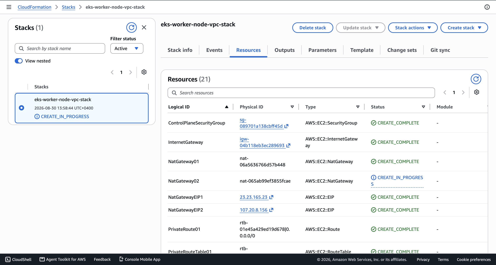
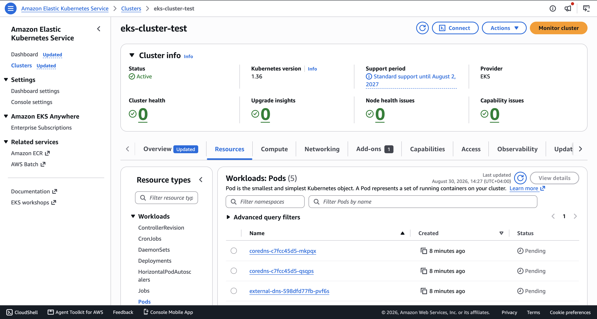
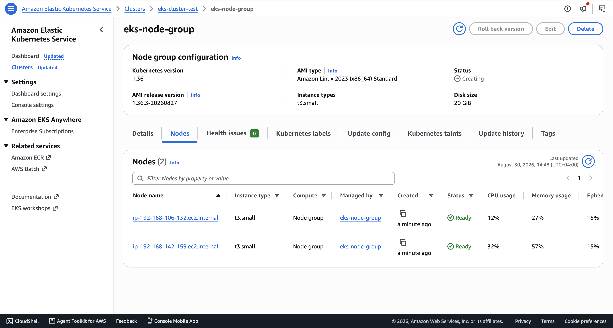

# Kubernetes on AWS - EKS Cluster with Node Group

Kubernetes (often abbreviated as K8s) is an open-source container orchestration platform designed to automate the deployment, scaling, management, and networking of containerized applications across a cluster of hosts.

Amazon Elastic Kubernetes Service (Amazon EKS) is a fully managed Kubernetes service that lets us run production-grade Kubernetes clusters on AWS without managing the control plane ourselves.

This project demonstrates how to provision an Amazon EKS cluster with a managed node group, configure IAM permissions, enable autoscaling, and deploy a sample application to the cluster.

## Overview

Kubernetes emerged as a platform for microservices applications, where services communicate via APIs, message brokers, or service meshes. In modern cloud-native platforms, Kubernetes has become the standard for running containerized workloads at scale.

Amazon EKS simplifies this by handling the Kubernetes control plane while allowing us to focus on workloads, networking, and operational automation.

### Amazon EKS key features

- Managed control plane with high availability across multiple Availability Zones
- Flexible worker node options: EC2 instances or AWS Fargate
- Native AWS integration with VPC, IAM, ELB, and Auto Scaling
- Standard Kubernetes tooling with kubectl, eksctl, Helm, and YAML manifests

## Demo Project

Create an AWS EKS cluster with a managed node group and deploy sample workloads to validate the cluster end-to-end.

## Technologies used

- Kubernetes
- Linux
- AWS EKS
- Amazon VPC
- Amazon EC2
- Elastic Load Balancing
- Auto Scaling Groups
- CloudFormation
- IAM
- kubectl

## Project Description

This hands-on project covers the following:

- Configure required IAM roles for the EKS control plane and worker nodes
- Create the VPC for worker node networking using the official Amazon EKS CloudFormation template
- Create the EKS control plane
- Connect kubectl to the cluster
- Create a managed node group and attach it to the cluster
- Configure cluster autoscaling for worker nodes
- Deploy a sample application to the Kubernetes cluster

## Repository structure

```text
kubernetes-aws-eks-cluster-with-node-group/
├── aws/
│   ├── cloudFormation/
│   │   └── amazon-eks-vpc-private-subnets.yaml
│   └── policies/
│       └── clusterAutoScalerPolicy.json
├── images/
│   ├── eks-cluster-test.png
│   ├── eks-node-group.png
│   └── eks-worker-node-vpc-stack.png
├── kubernetes/
│   ├── cluster-autoscaler-autodiscover.yaml
│   └── nginx.yaml
├── README.md
└── .gitignore
```

## Architecture overview

The solution uses the standard EKS architecture:

- Amazon EKS control plane: managed by AWS
- Worker nodes: EC2 instances in a node group
- VPC networking: public and private subnets
- IAM roles: for EKS control plane and node group permissions
- Auto Scaling Group: scales node count based on workload demand
- Sample workload: deployed as a Kubernetes Deployment and Service

## Implementation Guide

### 1. Prerequisites

Before creating the cluster, make sure the following are ready:

- AWS account with permissions to create IAM roles, VPCs, EC2, EKS, and IAM providers
- AWS CLI installed and configured
- kubectl installed
- Access to the AWS Management Console for validation

Configure AWS CLI credentials and verify the active account:

```bash
aws configure
aws configure list
aws sts get-caller-identity
```

Set the target AWS region before creating resources:

```bash
export AWS_REGION=us-east-1
aws configure set region us-east-1
```

---

### 2. Create the EKS IAM role

Amazon EKS requires a service role to manage resources on your behalf.

In AWS IAM, create a role named `eks-cluster-role` and attach the managed policy:

- `AmazonEKSClusterPolicy`

This IAM role allows the EKS service to create and manage the Kubernetes control plane and required networking resources.

---

### 3. Create the VPC for worker nodes

The worker nodes need a correctly designed VPC with public and private subnets so that control-plane communication and node traffic are correctly routed.

A recommended approach is to use the official CloudFormation template provided by AWS:

- `amazon-eks-vpc-private-subnets.yaml`

This template creates the networking resources needed for an EKS cluster, including:

- VPC
- Public and private subnets
- Route tables
- NAT gateways
- Security groups

The project uses the following template:

```text
aws/cloudFormation/amazon-eks-vpc-private-subnets.yaml
```

This is the infrastructure used for the cluster worker nodes.



---

### 4. Create the EKS cluster (control plane)

From the AWS EKS Console, create a new cluster using the created VPC.

Example configuration used in this project:

- Cluster name: `eks-cluster-test`
- Kubernetes version: 1.36
- Role: `eks-cluster-role`
- VPC: the worker node VPC created previously

After the cluster is created, validate that the control plane is healthy:

```bash
aws eks describe-cluster --name eks-cluster-test --region us-east-1
```

The AWS console screenshot below shows the created EKS cluster:



---

### 5. Connect kubectl to the EKS cluster

The next step is to download the cluster kubeconfig so that kubectl can interact with the EKS cluster.

```bash
# Check current AWS config and region
aws configure list

# Update the kubeconfig for the EKS cluster
aws eks update-kubeconfig --name eks-cluster-test --region us-east-1

# Verify the connection to the cluster
kubectl cluster-info
kubectl get nodes
```

This gives a local control point for Kubernetes operations and confirms the cluster is reachable from the workstation.

---

### 6. Create the EC2 IAM role for the node group

Worker nodes must have permissions to communicate with AWS services and run the Kubernetes runtime components such as kubelet and kube-proxy.

Create a new EC2 role named `eks-node-group-role` and attach the following managed policies:

- `AmazonEKSWorkerNodePolicy`
- `AmazonEC2ContainerRegistryReadOnly`
- `AmazonEKS_CNI_Policy`

These permissions allow worker nodes to:

- join the cluster
- manage networking with the Amazon VPC CNI plugin
- access container image registries
- run as Kubernetes worker nodes

---

### 7. Create the managed node group and attach it to the cluster

Once the node role is ready, create a managed node group.

In this project, the node group is configured as follows:

- Name: `eks-node-group`
- Role: `eks-node-group-role`
- Minimum size: 2
- Desired size: 2
- Maximum size: 2

This creates two EC2 instances behind an Auto Scaling Group (ASG).

When the node group is attached, Amazon EKS installs the required worker components automatically, including:

- kubelet
- kube-proxy
- container runtime

Check that the nodes are registered:

```bash
kubectl get nodes
kubectl get nodes -o wide
```

The AWS console screenshot below shows the created node group:



---

### 8. Configure cluster autoscaling

AWS does not automatically scale Kubernetes worker nodes based on pod demand. To solve this, we install the Kubernetes Cluster Autoscaler, which watches the cluster for unschedulable pods and adjusts the Auto Scaling Group size.

This is important for production readiness because it helps reduce idle infrastructure cost and ensures that the cluster can scale to meet application load.

#### 8.1. Why OIDC is required

The cluster autoscaler runs as a Kubernetes service account in the `kube-system` namespace. To allow it to call AWS APIs and manage EC2/ASG resources, we need to grant it permission through AWS IAM using OpenID Connect (OIDC).

This pattern uses a trust relationship between Kubernetes and AWS IAM:

- Kubernetes service account authenticates with the OIDC provider
- AWS STS returns temporary credentials
- The autoscaler assumes an AWS IAM role and can manage EC2/ASG resources

#### 8.2. Create a custom autoscaling policy

The project includes the policy file:

```text
aws/policies/clusterAutoScalerPolicy.json
```

The IAM policy grants permission to read EC2 and Auto Scaling information and to update desired capacity when pods need more capacity:

```json
{
  "Version": "2012-10-17",
  "Statement": [
    {
      "Action": [
        "autoscaling:DescribeAutoScalingGroups",
        "autoscaling:DescribeAutoScalingInstances",
        "autoscaling:DescribeLaunchConfigurations",
        "autoscaling:DescribeScalingActivities",
        "autoscaling:SetDesiredCapacity",
        "autoscaling:TerminateInstanceInAutoScalingGroup",
        "ec2:DescribeInstanceTypes",
        "ec2:DescribeLaunchTemplateVersions"
      ],
      "Resource": "*",
      "Effect": "Allow"
    }
  ]
}
```

Create a custom policy and attach it to an IAM role that the Kubernetes service account will assume.

#### 8.3. Set up the OIDC provider

In the AWS IAM Console, add the cluster's OIDC identity provider:

- Provider URL: the EKS cluster OIDC issuer URL
- Audience: `sts.amazonaws.com`

This is required so AWS knows that the Kubernetes service account token is valid and issued by the cluster itself.

#### 8.4. Create an IAM role for the service account

Create a role named `EKSServiceAccountRole`:

- Trust type: Web identity
- OIDC provider: the cluster issuer
- Audience: `sts.amazonaws.com`
- Attach the custom autoscaler policy

Then the cluster autoscaler service account can assume this role via the annotation:

```yaml
annotations:
  eks.amazonaws.com/role-arn: arn:aws:iam::ACCOUNTID:role/EKSServiceAccountRole
```

#### 8.5. Tag the Auto Scaling Group

To let the autoscaler discover the correct ASG, ensure the ASG is tagged with:

- `k8s.io/cluster-autoscaler/enabled`
- `k8s.io/cluster-autoscaler/<cluster-name>`

Example:

```text
k8s.io/cluster-autoscaler/enabled=true
k8s.io/cluster-autoscaler/eks-cluster-test=true
```

#### 8.6. Deploy the cluster autoscaler

The project includes the autoscaler manifest under:

```text
kubernetes/cluster-autoscaler-autodiscover.yaml
```

This file creates a `ServiceAccount`, RBAC rules, and a Deployment. The key configuration is shown below:

```yaml
apiVersion: v1
kind: ServiceAccount
metadata:
  name: cluster-autoscaler
  namespace: kube-system
  annotations:
    eks.amazonaws.com/role-arn: arn:aws:iam::ACCOUNTID:role/EKSServiceAccountRole
---
apiVersion: apps/v1
kind: Deployment
metadata:
  name: cluster-autoscaler
  namespace: kube-system
spec:
  replicas: 1
  template:
    spec:
      serviceAccountName: cluster-autoscaler
      containers:
        - name: cluster-autoscaler
          image: registry.k8s.io/autoscaling/cluster-autoscaler:v1.36.1
          env:
            - name: AWS_REGION
              value: "us-east-1"
          command:
            - ./cluster-autoscaler
            - --cloud-provider=aws
            - --node-group-auto-discovery=asg:tag=k8s.io/cluster-autoscaler/enabled,k8s.io/cluster-autoscaler/eks-cluster-test
```

Apply the manifest:

```bash
kubectl apply -f kubernetes/cluster-autoscaler-autodiscover.yaml
```

Verify it is running:

```bash
kubectl get deployment -n kube-system cluster-autoscaler
kubectl get pod -n kube-system
kubectl logs <autoscaler-pod-name> -n kube-system
```

The autoscaler will now monitor the cluster and scale the node group up or down based on pending pods and resource pressure.

---

### 9. Deploy a sample application

To validate the cluster, deploy a simple NGINX workload with a Kubernetes `Deployment` and a `LoadBalancer` service.

The manifest is stored in:

```text
kubernetes/nginx.yaml
```

```yaml
apiVersion: apps/v1
kind: Deployment
metadata:
  name: nginx
spec:
  selector:
    matchLabels:
      app: nginx
  replicas: 2
  template:
    metadata:
      labels:
        app: nginx
    spec:
      containers:
      - name: nginx
        image: nginx
        ports:
        - containerPort: 80
---
apiVersion: v1
kind: Service
metadata:
  name: nginx
  labels:
    app: nginx
spec:
  ports:
  - name: http
    port: 80
    protocol: TCP
    targetPort: 80
  selector:
    app: nginx
  type: LoadBalancer
```

Deploy the application:

```bash
kubectl apply -f kubernetes/nginx.yaml
```

Check that the workload is running:

```bash
kubectl get deployment
kubectl get pods
kubectl get svc
kubectl get nodes
```

The service type `LoadBalancer` triggers AWS to create an ELB for external access to the app.

---

### 10. Scale the workload and validate autoscaling

To validate the autoscaler, scale the NGINX deployment to a much higher number of replicas.

```bash
kubectl scale deployment nginx --replicas=20
kubectl get pods
kubectl get nodes
kubectl logs <autoscaler-pod-name> -n kube-system
```

As the cluster runs out of free capacity, the autoscaler will detect the pending pods and scale the EKS node group up automatically.

Then reduce the load to confirm scale-down behavior:

```bash
kubectl scale deployment nginx --replicas=1
kubectl get nodes
kubectl logs <autoscaler-pod-name> -n kube-system
```

This demonstrates both sides of cluster autoscaling:

- scale out when more pods need scheduling
- scale in when the workload shrinks and nodes are underutilized

---

## Key lessons learned

This project demonstrates several important DevOps and Kubernetes principles:

- EKS requires careful IAM and networking setup
- Node groups are the standard way to manage worker capacity on AWS
- Auto Scaling Groups and cluster autoscaler work together to handle demand
- Kubernetes abstractions such as Deployments and Services simplify application delivery
- Observability and validation are essential when working with distributed systems

## Final result

By the end of this walkthrough, the environment contains:

- A working Amazon EKS cluster
- A node group with EC2 workers
- A configured Kubernetes autoscaler
- A running sample application exposed through a LoadBalancer

This is a strong foundation for building larger production workloads, multi-service applications, and infrastructure-as-code automation on AWS.

## References

- AWS EKS Documentation: https://docs.aws.amazon.com/eks/
- Amazon EKS VPC and networking guide: https://docs.aws.amazon.com/eks/latest/userguide/creating-a-vpc.html
- Kubernetes Cluster Autoscaler: https://github.com/kubernetes/autoscaler
- AWS IAM OIDC for EKS: https://docs.aws.amazon.com/eks/latest/userguide/enable-iam-roles-for-service-accounts.html

